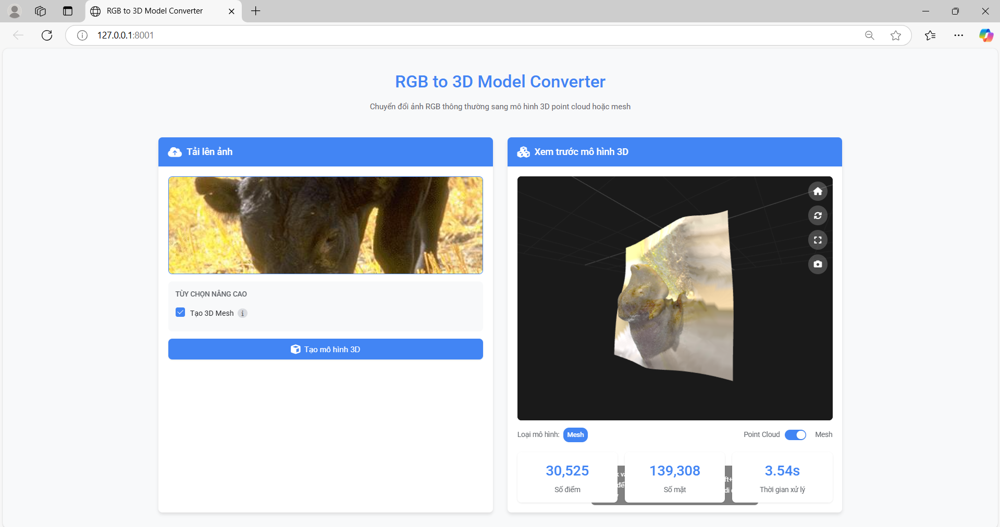

# Convert-2D-to-3D-images

This project allows you to convert **2D RGB images into 3D Point Clouds and Meshes**, powered by [DepthAnythingV2](https://github.com/DepthAnything/Depth-Anything-V2) for monocular depth estimation, and visualized directly in the browser.

---

## Features

-  Upload an RGB image via web interface
-  Generate accurate **depth map** using `DepthAnythingV2`
-  Convert depth map into interactive **3D point cloud**
-  Optionally reconstruct a **3D mesh** from point cloud
-  Display results directly in the browser using WebGL
-  Built with **FastAPI**, **Open3D**, **PyTorch**, and **Three.js**

---

## Model Used

We use **DepthAnythingV2 (ViT-L)** as the backbone for depth estimation.

- Download ViT-L: [Depth-Anything-V2-Large](https://huggingface.co/depth-anything/Depth-Anything-V2-Large/resolve/main/depth_anything_v2_vitl.pth?download=true)
- Pretrained weights used: `depth_anything_v2_vitl.pth`

---

## Installation

1. **Clone the repository**
```bash
git clone https://github.com/dolami2876/Convert-2D-to-3D-images.git
cd Convert-2D-to-3D-images
```
2. **Install dependencies**
```bash
pip install -r requirements.txt
```
3. **Run the server**
```bash
python app.py
```

---
## Folder Structure
```php
Convert-2D-to-3D-images/
│
├── static/                     # Frontend interface (HTML + JS + WebGL)
│   ├── index.html
│   ├── app.js
│   └── styles.css
│
├── Depth-Anything-V2/         # DepthAnythingV2 model
│
├── app.py                     # Main FastAPI backend
├── requirements.txt
└── depth_anything_v2_vitl.pth # Pretrained model weights (ViT-L)
```
---

## API Endpoint
POST /upload
Form-Data Parameters:

**file**: Image file (.jpg, .png, etc.)

**generate_mesh**: (optional) true / false – to generate 3D mesh

Returns:

**point_cloud**: List of 3D points with RGB color

**mesh**: (if enabled) Dictionary with vertices, faces, and colors

---
## Example Result
<p align="center">
  
</p>
---

# Thanks for watching!


